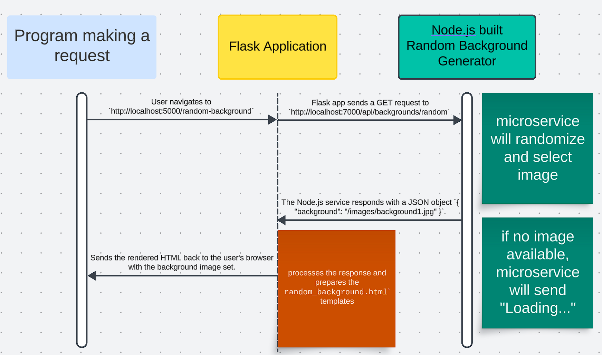

# CS361-Microservice-A

Microservice A - random background generator
This is a microservice that generates random background images. It serves static images stored in the `images` directory.

## Background Service Integration with Flask

This guide explains how to use the background generation microservice built with Node.js and Express in a Python Flask application.

## Prerequisites

- Node.js installed on your machine
- Python installed on your machine
- Flask installed in your Python environment

## Setting Up the Background Service

**Clone the Repository or Download the Zip File**

```bash
git clone git@github.com:danny-alarcon97/CS361-Microservice-A.git
cd CS361-Microservice-A
```

## Prerequisites for Python Flask

1. Create virtual environment:

```bash
python -m venv venv
source venv/bin/activate # On Windows use `venv\Scripts\activate`
```

2. Install Flask:

```bash
pip install Flask
```

1. Create the Flask App:

Create an `app.py` file with the basic Flask setup.

Example:

```python
@app.route('/random-background')
def random_background():
    response = requests.get('http://localhost:7000/api/backgrounds/random')
    if response.status_code == 200:
        data = response.json()
        background_url = 'http://localhost:7000' + data['background']
        return render_template('random_background.html', background_url=background_url)
    else:
        return "Error fetching background image", response.status_code
```

4. Create HTML Templates:

Create a `templates` directory and add the HTML templates.
`templates/index.html`
`templates/random_background.html`

5. Run the Flask App:

```bash
python app.py
```

## Make HTTP Requests to the Microservice

The Flask route `/random-background` makes a GET request to the Node.js microservice to fetch a random background image URL.

## Display the Background Image

The fetched background image URL is passed to the `random_background.html` template, which uses it as the background image.

## UML Sequence Diagram


